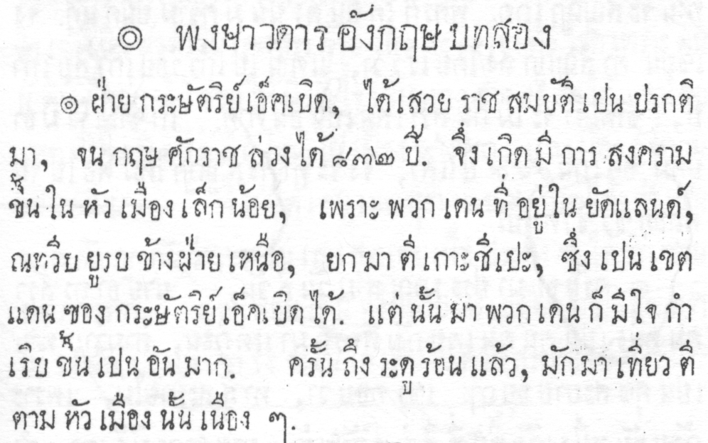
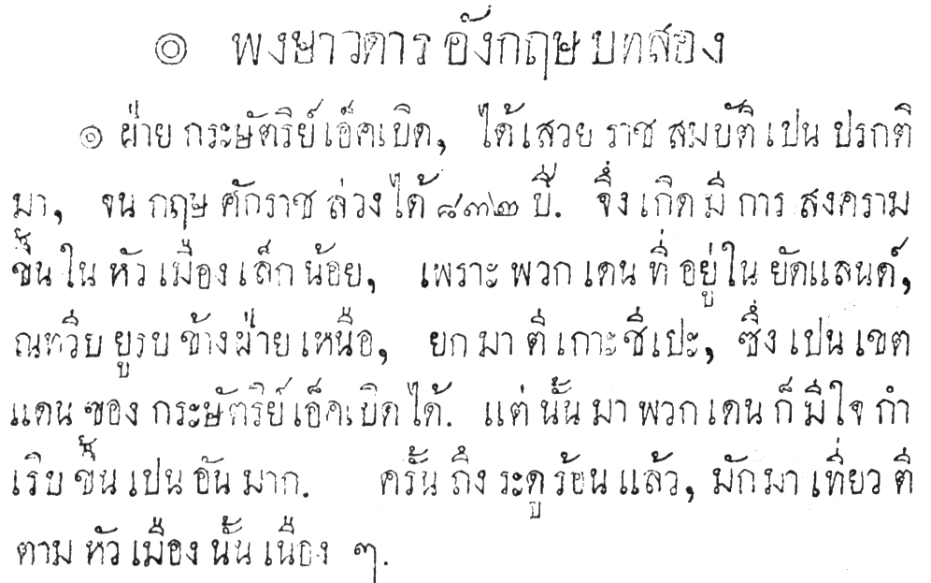
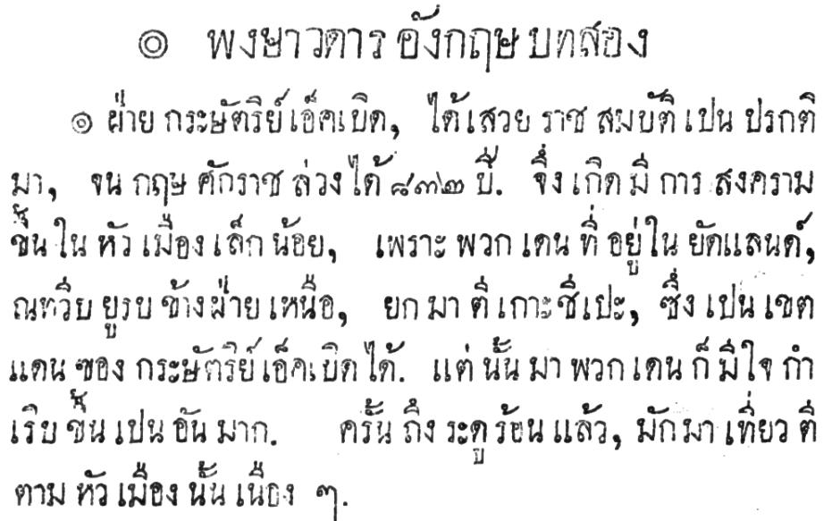

This technical post describes a few simple steps for programmatically cleaning document scans with the [python](http://python.org) programming language. The concepts can be used for batch processing hundreds of images quickly and consistently.

<!--more-->

As well as python we also use the [OpenCV](http://opencv.org) 3.x image processing library. This tutorial assumes familiarity with both python and how to install software libraries.

To load a image into a script with OpenCV, use the cv2.imread() function. Here the image is loaded as greyscale:

```python
import cv2
img = cv2.imread("example1.png", cv2.IMREAD_GRAYSCALE)
```



All the images in this post can be seen full size with right-click (control-click on a Mac) and then _Open Image in New Tab_.

Note that this image has a light grey background and there’s a faint imprint of the opposite side of the page which we want to remove.

Let’s adjust the contrast to accentuate the dark greys from the light greys and remove the imprint from the other page:

```python
img = cv2.multiply(img, 1.2)
```



Simple – much cleaner! However, notice the text has become less clear than in the original. We can fix this with [morphological transformations](http://docs.opencv.org/3.0-beta/doc/py_tutorials/py_imgproc/py_morphological_ops/py_morphological_ops.html). Normally these operate on 2-bit images (eg. black & white) where a 0 (zero) represents the background and a 1 represents the foreground. Our image is the opposite to that so we use the opposite functions.

But first we need a kernel – basically a two dimensional bit mask array. For our image we just need some subtle changes so we’ll use a simple 1×1 array with a content of 1. Kernels are [numpy](https://numpy.org/) arrays and the numpy library is normally installed automatically with OpenCV, we just need to import it.

```python
import numpy as np
kernel = np.ones((1, 1), np.uint8)
```
Now we have a kernel we use it to apply the `cv2.erode()` function to the image. Usually the `cv2.dilate()` function would be used but our image is colour inverted compared to what it normally expects. `erode()` and `dilate()` can also run iteratively multiple times, but we just need it once for this example.

```python
img = cv2.erode(img, kernel, iterations=1)
```

This gives us much clearer text, more like in the original file but without the distracting background noise:



See the [morphological transformations](http://docs.opencv.org/3.0-beta/doc/py_tutorials/py_imgproc/py_morphological_ops/py_morphological_ops.html) documentation for further details and some good usage examples. Also, experiment with the kernel size, content and iterations for different results.

Now we have a cleaner image, save it using cv2.imwrite(). We’ll save in PNG format but OpenCV also supports other common formats.

```python
cv2.imwrite("example1-processed.png", img)
```

All done! To sum-up, here’s our full program:

```python
#!/usr/bin/python

import cv2
import numpy as np

# load image
img = cv2.imread("example1.png", cv2.IMREAD_GRAYSCALE)

# adjust contrast
img = cv2.multiply(img, 1.2)

# create a kernel for the erode() function
kernel = np.ones((1, 1), np.uint8)

# erode() the image to bolden the text
img = cv2.erode(img, kernel, iterations=1)

# save the file
cv2.imwrite("example1-processed.png", img)
```
