The first article on this topic introduced basic automation techniques for cleaning document scans. This article builds on those foundations by introducing more advanced topics for background removal, frame removal and rotation correction.

## Enhanced Background Removal

Let’s start from this image:

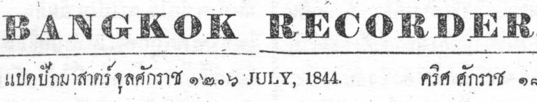

First, let’s try a basic binary threshold. This checks each pixel’s intensity against a threshold and one side of the threshold gets a 1, the other side a 0.

```python
THRESHOLD = 127
ret, thr1 = cv2.threshold(img, THRESHOLD, 255, cv2.THRESH_BINARY)
```

Here’s 3 different thresholds, notice how the print contrast varies across the page:

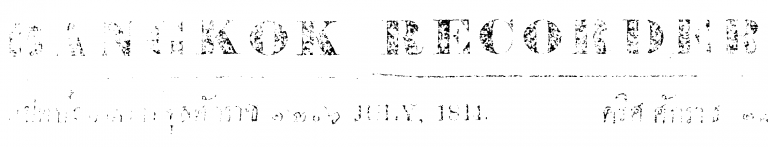
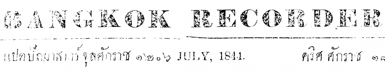
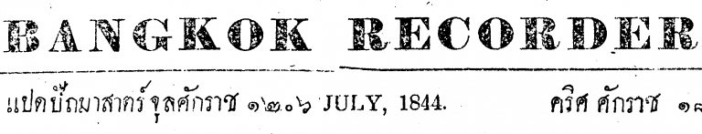

This works fairly well, but a method for finding the optimum threshold would be useful. For this we can first try an adaptive threshold. This one, for example, for each pixel takes the Gaussian weighted value of the pixels around it:

```python
adt = cv2.medianBlur(img, 7)
adt = cv2.adaptiveThreshold(
        adt, 255,
        cv2.ADAPTIVE_THRESH_GAUSSIAN_C,
        cv2.THRESH_BINARY, 3, 2
)
```

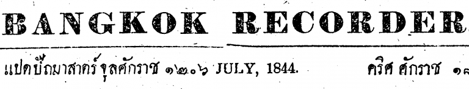

Although the print contrast is more even, it’s still not so clear, so let’s add a little more “intelligence” to it. [Otsu Binarization](http://docs.opencv.org/3.1.0/d7/d4d/tutorial_py_thresholding.html) should be able to help as our images are bimodal, that is, there’s 2 primary pixel intensities and it finds the low point between two peaks in the histogram of an image and uses that as the threshold value (shown by the red line in this histogram):

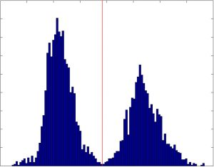

```python
ato = cv2.GaussianBlur(img, (1, 1), 0)
ret, gato = cv2.threshold(gato, 0, 255, cv2.THRESH_BINARY +
                          cv2.THRESH_OTSU)
```

and here’s the result. Much clearer.


## Frame Removal

Scans often have unwanted areas around the edges of pages such as to the right and bottom of this page:

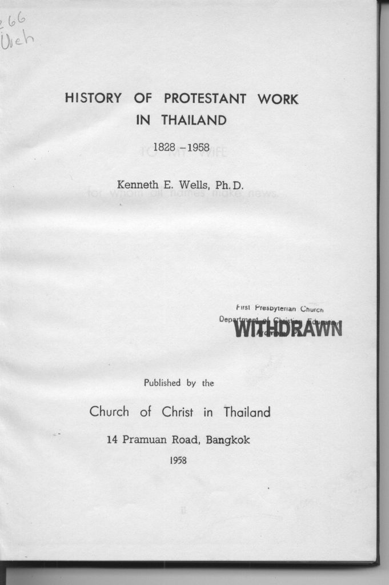

We can process this in two steps. First remove the background, as outlined above and then find contours in the image. _Contours_ are defined as “a curve joining all the continuous points (along the boundary), having same colour or intensity.” The background removal improves this image but the frame remains as a thick black border due to the binarization:

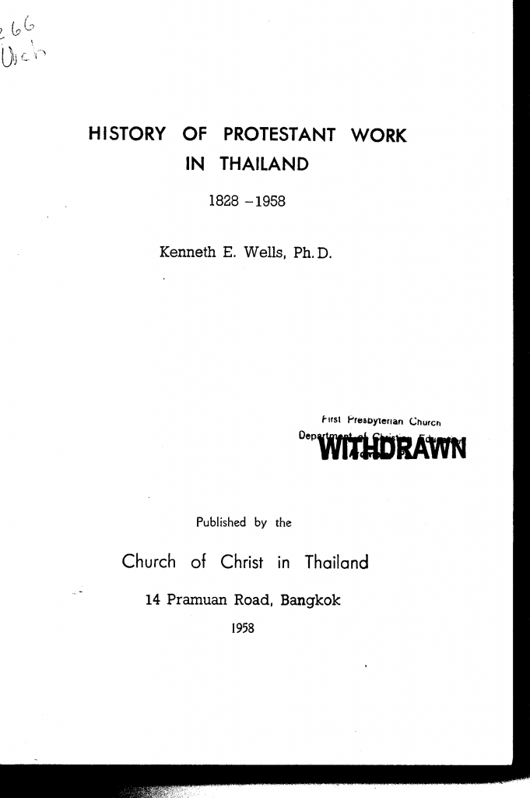

Let’s find the contours in this image which will be the perimeter of the white page.

```python
# get all contours
img2, contours, hierarchy = cv2.findContours(img, cv2.RETR_TREE,
                                             cv2.CHAIN_APPROX_SIMPLE)

# find largest contour
contour_areas = map(cv2.contourArea, contours)
largest_contour_idx = contour_areas.index(max(contour_areas))
largest_contour = contours[largest_contour_idx]
```

Here it is visualised:

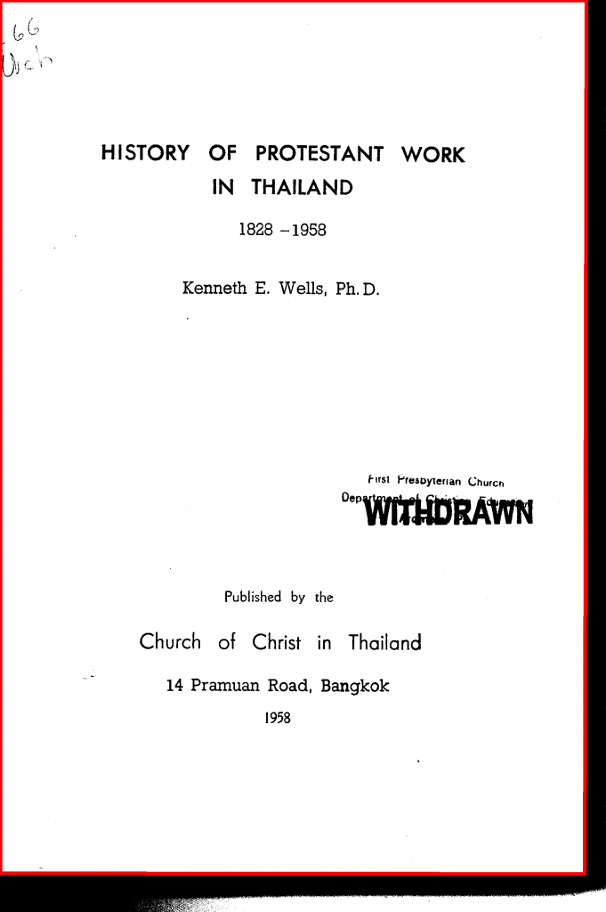

We now just crop the image:

```python
out = out[min_y:max_y, min_x:max_x]
```

where the min/max variables are found in the largest_contour coordinates:

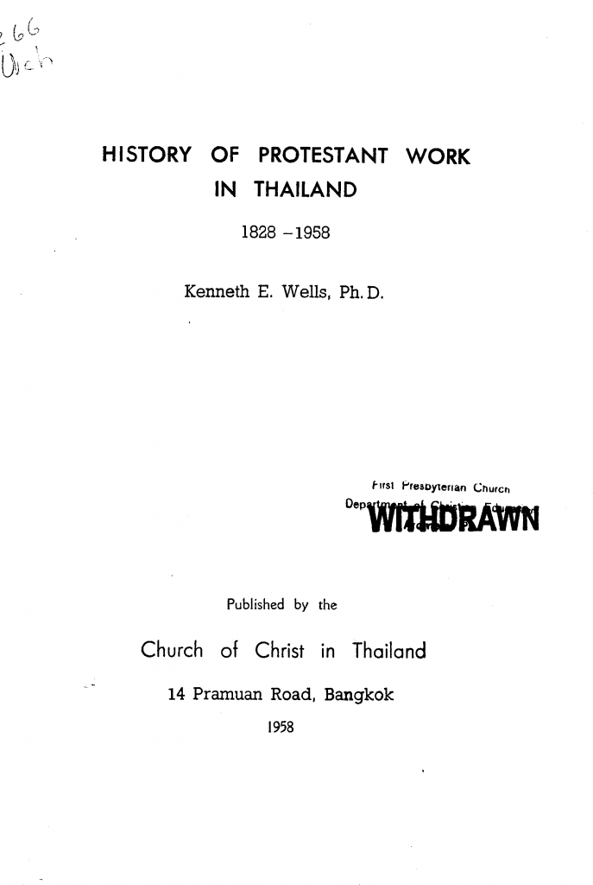

## Skew Correction

Skew is the rotation of a document and scanned documents are often affected by a few degrees — enough to be distracting to readers.

Let’s see how to correct it starting with this 2-bit image:

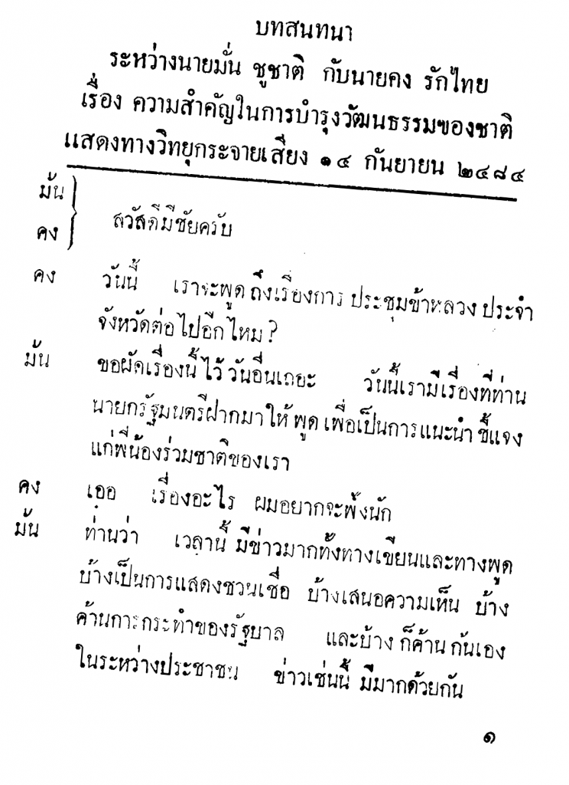

To detect the skew we use a feature called [Hough Line Transform](http://docs.opencv.org/3.0-beta/modules/imgproc/doc/feature_detection.html) to find lines in the image. The angle of each line can be calculated and used to correct the skew.

```python
import numpy as np

neg = 255 - img  # get negative image
angle_counter = 0 # number of angles
angle = 0.0 # collects sum of angles

# get all the Hough lines
for line in cv2.HoughLinesP(neg, 1, np.pi/180, 325):
    x1, y1, x2, y2 = line[0]

    # calculate the angle (in radians)
    this_angle = np.arctan2(y2 - y1, x2 - x1)
    if this_angle and abs(this_angle) <= 10:
        # filtered zero degree and outliers
        angle += this_angle
        angle_counter += 1

# the skew is calculated of the mean of the total angles
skew = np.rad2deg(angle / angle_counts)
```

Here’s `cv2.HoughLinesP()` in action:

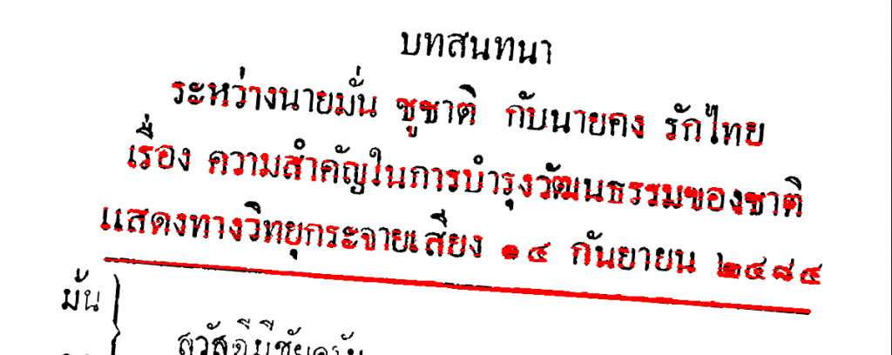

The value of skew from this example came to about 5.49, meaning the image is rotated 5.49° clockwise. So, let’s rotate it the same amount in the opposite direction.

We need two things for a rotation – the amount to rotate and the centre of the rotation. These need to be combined into a rotation matrix and OpenCV provides the `cv2.getRotationMatrix2D()` function for this. We’ll use the centre of the image as the rotation centre point and a scale factor of 1.0 (keep same size).

Once we have the rotation matrix, we use `cv2.warpAffine()` to rotate. flags sets the interpolation method for the rotation. `borderMode` and `borderValue` set a constant value (white in this case) for any exposed border areas (eg. at the image corners where there’s rotation.

```python
rows, cols = image.shape
rot_mat = cv2.getRotationMatrix2D((cols/2, rows/2), angle, 1.0)
result = cv2.warpAffine(image,
                        rot_mat,
                        (cols, rows),
                        flags=cv2.INTER_CUBIC,
                        borderMode=cv2.BORDER_CONSTANT,
                        borderValue=(255, 255, 255))
```

And here’s the final corrected image:

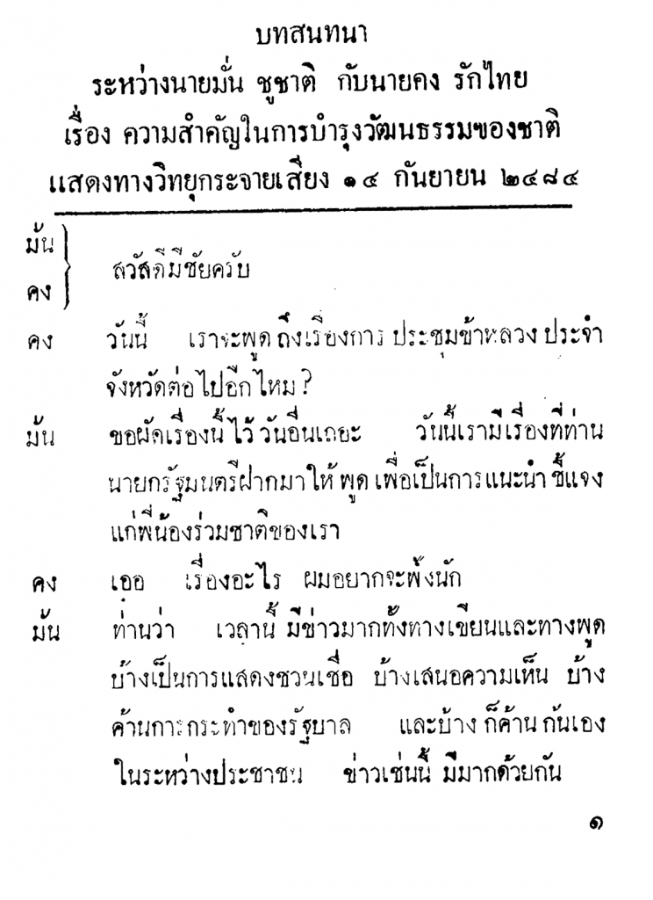

## Summary

The techniques presented in these two blog posts demonstrate how to programmatically process document scans to remove frames, backgrounds and skew. This prepares the images for structural analysis, eg. detecting headings, columns, tables etc. which will be the topic the next post in the series.
