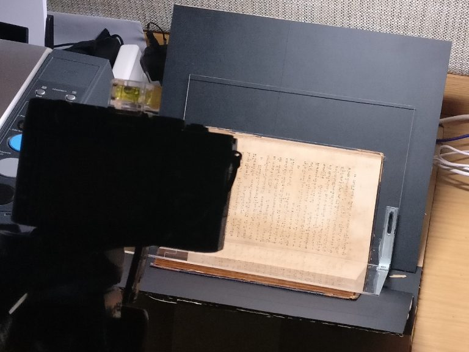
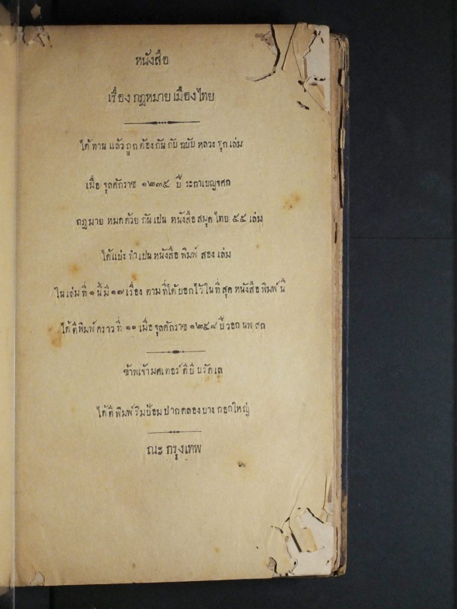

A few of the books I’ve collected are very old, fragile and can’t be digitised on either a normal flatbed scanner or [flatbed book scanner](http://plustek.com/usa/products/book-scanners/) without damaging them. So, I’ve built a camera-based book scanner.

Several [blogs](https://diybookscanner.org/) discuss book scanning equipment and there’s just a few components needed:

1. Lighting: studios lights, although expensive, would be good; I settled for a bright white LED desk lamp
2. Camera(s): to take photos of the open pages. I’ve just used one, taking photos of all the odd-numbered pages then all the even-numbered pages
3. Platen: a v-shaped glass or acrylic plate to put on top of the book to keep the pages flat
4. Book: not much point without it, eh?
5. Cradle: this is what the book is placed on, a v-shaped support

The cradle I made from the packaging of a household appliance with plenty of [gaffer tape](https://www.google.co.th/search?q=gaffer+tape&tbm=isch). Very [Blue Peter](https://www.bbc.co.uk/cult/classic/bluepeter/valpetejohn/trivia.shtml).

I’ve used two A4-size clear acrylic sheets, 2mm thick for the platen. They’re mounted at 90° with two spare metal brackets — some left-overs from Ikea furniture. Use epoxy resin for a strong bond between metal and acrylic.

The camera should be fairly high resolution with good optics. I’m using my trusty  Fujifilm X-T20* on a tripod and it works fine for the books I’ve tested it with (approximately A5 size). Setting the camera to manual mode gives the best control and the ability to manually focus for the sharpest images, although the focus needs adjusting every 10 pages or so.

View from behind the camera (note the OptiBook scanner to the left that’s not in use!)

For the curious among you, the book I’m scanning is [Dr. Bradley’s](https://en.wikipedia.org/wiki/Dan_Beach_Bradley) book of Thai Law. Here is a down-sized image of the cover page:

**Update 8th April:** All 505 pages of this book have now been photographed at 24MP resolution and the process of cleaning the images will begin soon.

## Footnote

\* My trusty Fujifilm X-10 broke after scanning 50% of the book. It was a good camera that I used for the last 5-6 years and I’ve stayed with Fujifilm — first impressions of the X-T20 is it’s awesome!
