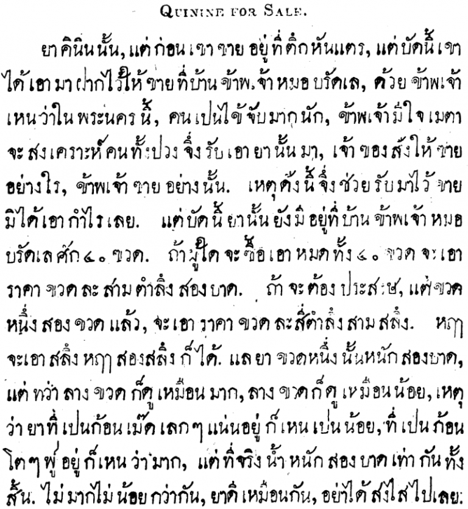
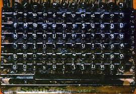
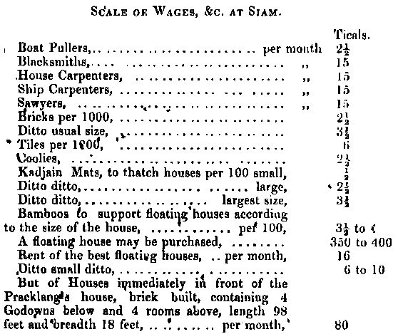

The February 1845 edition of the [Bangkok Recorder](https://markhollow.com/2016/12/23/the-bangkok-recorder/) contained a first for Siam: the country’s first newspaper classified advertisement.

<!--more-->

The item for sale is Quinine which at the time was considered a treatment for a range of conditions including malaria, fever, indigestion, varicose veins, mouth and throat diseases, and cancer.

[Dr Bradley](https://en.wikipedia.org/wiki/Dan_Beach_Bradley), a Christian missionary and the publisher of the Bangkok Recorder, became well known for his skills as a doctor and treated both the rich and the poor. Among his many achievements, he was the first doctor to perform surgery in Siam, removing a cancerous tumour from a slave and later developed the first vaccination (for smallpox) in Siam [1]. [Bangkok Christian Hospital](https://en.wikipedia.org/wiki/Bangkok_Christian_Hospital), Silom Road, Bangkok posthumously honoured him in 1981 by naming one of their buildings after him.

The classified advertisement is as follows:

The following transcription is perhaps easier to read:

> Quinine for Sale.
>
> ยา คินิน นั้น, แต่ ก่อน เฃา ฃาย อยู่ ที่ ตึก หันแตร, แต่ บัด นี้ เขา​    
> ได้ เอา มา ฝาก ไว้ ใ ฃาย ที่ บ้าน เจ้า หมอ บรัดเล, ด้วย ข้าพเจ้า​  
> เหน ว่า ใน พระนคร นี้, คน เปน ไข้ จับ มาก นัก, ข้าพเจ้า มี ใจ เมตา​  
> จะ สงเคราะห์ คน ทั้ง ปวง จึง เอา ยา นั้น มา, เจ้าฃอง สัง ให้ ฃาย​  
> อย่าง ใร, ข้าพเจ้า ฃาย อย่าง นั้น.  เหตุดัง นี้ จึ ช่วย รับ มา ไว้ ฃาย​  
> มิ ได้ เอา กำไร เลย. แต่ บัด นี้ ยา นั้น ยัง มี อยู่ ที่ บ้าน ข้าพเจ้า หมอ​  
> บรัดเล ศัก ๔๐ ฃวด. ถ้า ผู้ใด จะ ซื้อ เอา หมด ทั้ง ๔๐ ฃวด จะ เอา​  
> ราคา ฃวด ละ สาม ตำลึง สอง บาด.  ถ้า จะ ต้อง ประสงษ, แต่ ฃวด  
> หนึ่ง สอง ฃวด แล้ว, จะ เอา ราคา ฃวด ละ สี่ ตำลึง สาม สลึง.  หฤๅ​  
> จะ เอา สลึง หฤๅ สอง สลึง ก็ ได้. แล ยา ฃวด หนึ่ง นั้น หนัก​สอง บาด,  
> แต่ ทว่า ลาง ฃวด ก็ ดู เหมือน มาก, ลาง ฃวด ก็ ดู เหมือน น้อย, เหตุ​  
> ว่า ยา ที่ เปน ก้อน เม๊ด เลกๆ แน่น อยู่ ก็ เหน เปน น้อย, ที่ เปน ก้อน​  
> โตๆ พู๎ อยู่ ก็ เหน ว่า มาก, แต่ ที่ จริง น้ำ หนัก สอง บาด เท่า กัน ทั้ง​   
> สิ้น. ไม่ มาก ไม่ น้อย กว่า กัน, ยา ดี เหมือน กัน, อย่า ได้ สงไส ไป เลย.

A rough translation (corrections & improvements welcome!):

> Quinine for Sale.
>
> Quinine medicine was previously sold at Hunter’s Store, but currently he has deposited it for sale at my [Dr Bradley’s] house, since I have seen in the capital many people have a bad fever.
>
> I have the kindness to aid everyone so have brought the medicine here, and the owner [Hunter] instructed how it should be sold, and I have thus assisted in the sale not taking any profit. But currently at my home there are still about 40 bottles. If anyone would like to purchase all 40 bottles the price per bottle is 3 tamlung 2 baht. If you intend for only one or two bottles, the price is 4 tamlung 3 salung or I can even take a salung or two [discount].
>
> The medicine bottles have the weight of two baht, but some appear more, some appear less for the reason that the medicine in small tablets sit closer together looking small, the large tablets look greater, but in truth the weight of two baht [of each bottle] is equal in every way. No more or less than each other, the same good medicine, don’t doubt it!

## Who was Hunter?

Hunter’s Store (ตึกหันแตร or more formally ห้างหันแตร) was a very profitable foreign-owned factory/warehouse supplying many goods to the royal family of King Rama III.

Robert Hunter was a British (Scottish to be precise) merchant who had lived in India and Singapore before settling in Siam. On his arrival he presented King Rama III with 1,000 muskets and in return was granted a license for his factory, trading as the company Morgan, Hunter and Co.[2]

His later complaints to British India about Siamese trade practices, monopolies and taxation were an impetus to the eventual signing of the [Bowring Treaty](https://en.wikipedia.org/wiki/Bowring_Treaty) (1855) which formalised foreign trade relations between Siam and the British Empire.

It was not a fair treaty to the Siamese — the British had only recently shown their strength in the [First Opium War with China](https://en.wikipedia.org/wiki/First_Opium_War) (1839-42) and the [Treaty of Nanking](https://en.wikipedia.org/wiki/Treaty_of_Nanking) (1842) had ceded Hong Kong to the British. The Siamese were well aware of the threat if they did not act somehow.

The Treaty established favourable conditions for British merchants by limiting import/export duties, allowing the right to live in Bangkok (within certain areas), granting freedom of travel in the Kingdom and the right to trade directly with Siamese people without interference of the authorities.

Hunter also enjoyed partying. A lot. In response to an invitation from Hunter to Dr. Bradley and his wife to attend a party on January 1st, 1836, Bradley’s religious convictions necessitated a written response declining the invitation in which he stated: [2]

> [W]e have long had the impression that dinner parties conducted after the manner of Europeans in the East are not calculated to benefit the host, the guest or the community; but that they are too often powerfully efficient in fostering intemperance both in eating and drinking and a host of consecutive evils.

## Archaic Spellings

The writings in the Bangkok Recorder used many different spellings compared to modern-day Thai, but common at the time. There were no published dictionaries — the first edition of Royal Institute Dictionary wouldn’t be published for over 100 years and it would be another 30 years until Bradley published his own monolingual Siamese dictionary in 1873, the year of his death.

Notable is the use of the now obsolete letters [ฃ ขวด](https://en.wikipedia.org/wiki/Kho_Khuat) and ฅ คน. Many common words had different spellings too. Here are a few examples from above (old spelling = new spelling):

> เหน = เห็น  
>
> เปน = เป็น  
>
> สงไส = สงสัย
>
> ฃวด = ขวด – using the now-obsolete letter ฃ ขวด instead of the modern-day spelling with ข ไข่
>
> ฃาย = ชาย – ditto
>
> หฤๅ = หรือ

In this particular ad, the one use of the word คน uses the letter ค คน instead of ฅ คน. The demise of ค คน and ฃ ขวด didn’t really start until over 50 year’s later when the first Siamese 84-key typewriters would be imported with those 2 letters missing as there were [not enough keys](http://www.t-h-a-i-l-a-n-d.org/smithpremier/smithpremierorigin.html) on a standard typewriter mechanism to include all the letters of the alphabet [3]:

## How much is that?
The ad refers to both the price and weight of the bottles in baht. As a unit of mass (or weight in layman’s terms) [one baht is equal to 15.244 grams](https://en.wikipedia.org/wiki/Thai_baht#Money_and_unit_of_mass). Silver (เงิน) was the primary currency so 15.244 grams of silver equaled 1 baht of monetary value. These days the common meaning of the word เงิน refers to _money_.

The weight is reasonably assumed to be for only the medicine, not including the bottle itself. As a 2 baht weight is about 30 grams then comparing with the average weight of a common modern tablet (500mg paracetamol) of [0.68 grams](https://tflabreport2014.blogspot.com/p/practical-33-uniformity-of-weight-of.html) would indicate each bottle contains an average of 44 tablets, or allowing for the inaccuracy of the comparison, it was probably 50 tablets. This, of course, may not be an entirely accurate comparison but can perhaps be considered indicative. Dr Bradley also writes that there are two different sizes of tablets, which it is assumed contained the equivalent amount of the active ingredient.

The monetary units at the time of publication were more complex than the modern units of baht and satang (1 baht = 100 satang). It wasn’t until 1897 that King Rama V reformed the currency and prior to that monetary units were as follows (adapted from [Wikipedia](https://en.wikipedia.org/wiki/Thai_baht#Money_and_unit_of_mass)):

Unit | Thai spelling | Relative value | Value relative to baht
--- | --- | --- | ---
Bia | เบี้ย | 1⁄100 at | 1⁄6400
Solot | โสฬส | 1⁄16 fueang | 1⁄128
At | อัฐ | 1⁄8 fueang | 1⁄64
Siao/Phai | เสี้ยว/ไพ | 1⁄4 fueang | 1⁄32
Sik | ซีก | 1⁄2 fueang | 1⁄16
Fueang | เฟื้อง | 1⁄8 baht | 1⁄8
Salung | สลึง | 1⁄4 baht | 1⁄4
Baht | บาท | - | 1
Tamlung | ตำลึง | 4 baht | 4
Chang | ชั่ง | 20 tamlung | 80
Haab | หาบ | 80 Chang | 6,400 baht

So, from Bradley’s advert it can be deduced that:

For all 40 bottles:

* 3 tamlung 2 baht = 14 baht per bottle
* 40 x 14 baht = 560 baht total or 28 satang per tablet
* As 1 baht is about 15g of silver, at modern prices (US$0.55/gram) that’s equal to US$4,500.

For purchasing only 1 or 2 bottles:

* 4 tamlung 3 salung = 19 3⁄4 baht per bottle or 40 satang per tablet
* In modern prices, about US$160 per bottle.

To put those prices into context, the following table published seven years later in 1852 [4] shows how expensive cost of this medicine was: (Note: A Tical is a Western word for Baht)

So it can be seen that even at the discounted bulk prices, one bottle of quinine tablets was more than the monthly earnings of a skilled labourer such as a carpenter or blacksmith and greater than the monthly rental of a small house.

Unfortunately, Bradley does not record in his journal whether the medicine was sold or not.

## References

1. _Ed. Feltus, G. H._ Abstract of the Journal of Rev. Dan Beach Bradley, M.D. Medical Missionary in Siam 1835 – 1873. _Page 16_
2. _Peter Sek Wannamethee_ Anglo-Siamese Economic Relations: British Trade, Captial and Enterprise in Siam, 1856-1914. PhD Thesis, _Page 31-33_
3. Typewriter image from http://www.t-h-a-i-l-a-n-d.org/smithpremier/smithpremierorigin.html
4. _Malloch, D.E._ Siam: Some General Remarks on its Productions, and particulary on it Imports and Exports and the mode of Transacting Business with the People. _Page 68_

The title image “Quinine Sulphate” is copyright 2012 kookykrys and used under an Attribution-NonCommercial-NoDerivs 2.0 Generic license.
