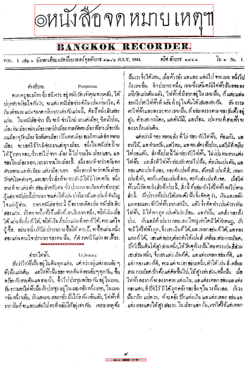
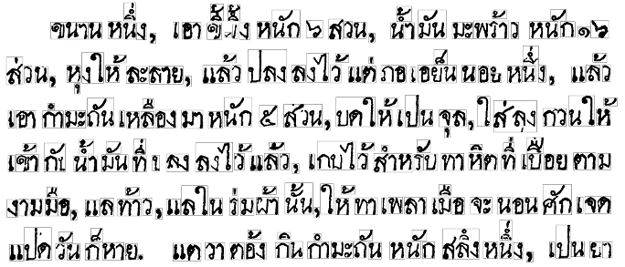
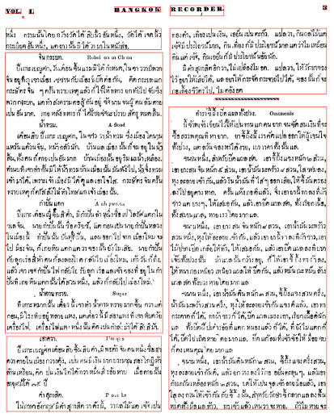
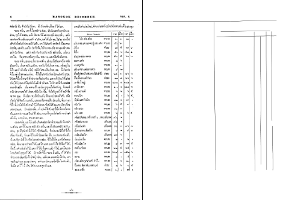
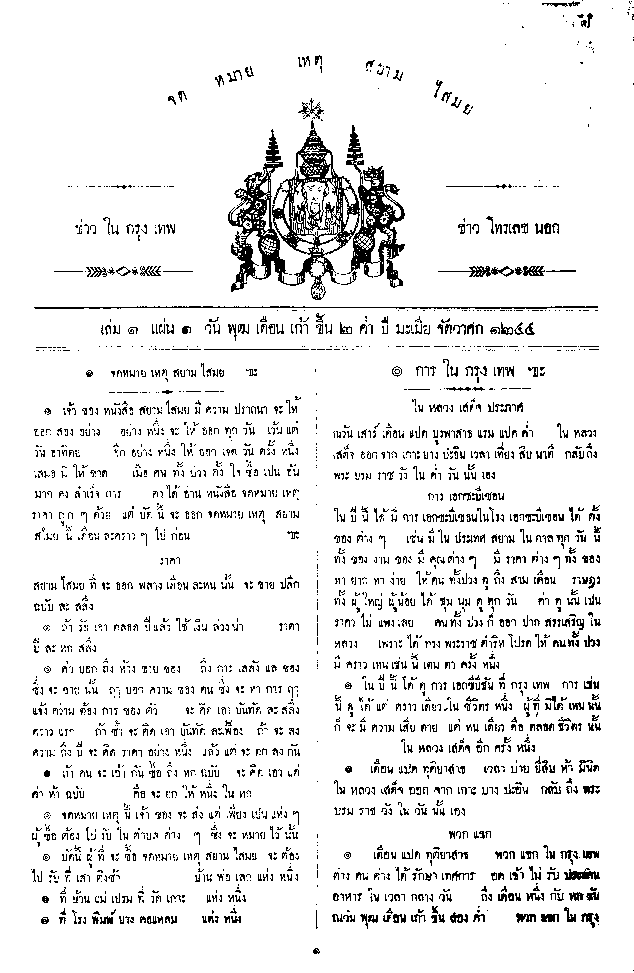

Although this blog has been silent for a few months, progress has continued as time permits. This article gives a summary update of the current status.

## Template Matching

[Template matching](https://docs.opencv.org/3.1.0/d4/dc6/tutorial_py_template_matching.html) is the search for a small image within a larger image. In this project we can use them to detect common features such as the titles on page 1 of each edition as well as the decorative column dividers. These features can be used to appropriately tag pages (eg. as a first page) to help with structural analysis.

## MSER Text Detection

[Maximally Stable Extremal Regions](https://en.wikipedia.org/wiki/Maximally_stable_extremal_regions), or MSER, is a feature detection algorithm which excels at finding text in an image. In the example, individual and small groups of letters, each an MSER, are clearly identified. These are used to detect areas of text in a page and can be grouped together by proximity.

On each page there can be thousands of these small regions so combining them by proximity is computationally intensive. To do this efficiently an [R-Tree index](https://en.wikipedia.org/wiki/R-tree) is built which provides quick searches through the 2D space.

## Line Detection

In last year’s PyCon APAC presentation I detailed basic techniques for detecting lines which mark-up the page structure using morphological transformations but these proved to be inflexible with all documents, in particular when the lines are not particularly straight. Therefore I developed a quick solution using MSER to find all the text which can be removed, leaving just the lines. The lines can then be traced with [Probabilistic Hough Line Transforms](https://docs.opencv.org/3.1.0/d6/d10/tutorial_py_houghlines.html). This is perfect for identifying the markers between columns and in tables:

## Other Work

Alongside the technical work above, I’ve also been working on:

* scanning more pages of the Bangkok Recorder newspapers – nearly done, the end is in sight
* scanning the จดหมายเหตุสยามไสมย newspaper of Rev. Samuel Smith. There’s a total of five volumes of this paper to do!
* other documents to process and put online include Dr.Bradley’s Treatise on Vacinations (1840)
* further, as yet incomplete, work is on programmatic conversion of dates in the different calendar systems. Over the New Year period I purchased several books on the subject including those of Dr. J.C. Eade and the Astrological Scriptures (คัมภีร์โหราศาสตร์ไทยมาตรฐานฉบับสมบูรณ์). Technical work is in progress on the programming and there’s also a presentation in progress for if I can find a seminar that covers both astrology and coding…

## Next Steps

With the basics of page structural analysis complete, the next step will be to evaluate OCR systems. The main contenders are:

* Google’s OCR API – quick tests have worked well, although it doesn’t maintain the inter-word spacing used in much of Bradley’s print
* Tesseract – this will likely need training before accurate results can be obtained
* FineReader – not possible to control programmatically AFAIK, so I’ll probably give this one a miss.

With luck, and a little more time to dedicate to this project, I hope the next update won’t take quite so long…
